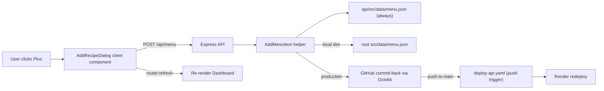

## Architecture



The "concern" you raised is solved by the helper writing to multiple destinations based on environment:

- Local dev: writes to both `api/src/data/menu.json` and root `src/data/menu.json` (you commit them); next `build:api` correctly preserves the item
- Production (Render): writes to `api/src/data/menu.json` (immediate visibility) AND commits both files to the repo via Octokit so future builds/deploys carry the item
- Detection is automatic: write to root file only if its path exists on disk; commit-back only if `GH_TOKEN` env var is set

## API changes

### 1. Add JSON body parsing — [api/src/server.ts](api/src/server.ts)

Add `app.use(express.json())` before `app.use("/api", routes)`.

### 2. New route — [api/src/routes/menu-routes.ts](api/src/routes/menu-routes.ts)

Add:

```ts
router.post("/", CreateMenuItem);
```

Import `CreateMenuItem` from the controller.

### 3. New controller — [api/src/controllers/menu-controller.ts](api/src/controllers/menu-controller.ts)

Add `CreateMenuItem(req, res)` that:

- Validates `req.body` shape: `{ name: string, sides: string[] }` (non-empty `name`, `sides` is array of trimmed non-empty strings)
- Calls `AddMenuItem(name, sides)` helper
- Returns the created item (with new `id`) with status 201
- 400 on validation error, 500 on write/commit error

### 4. New helper — [api/src/utils/menu-helper.ts](api/src/utils/menu-helper.ts)

Add `AddMenuItem(name: string, sides: string[]): Promise<Menu>`:

- Read current `api/src/data/menu.json`
- Compute next id = `Math.max(...ids) + 1` (or `1` if empty)
- Append `{ id, name, sides }`
- Write updated array to `api/src/data/menu.json`
- If `path.resolve(DATA_DIR, "../../../src/data/menu.json")` exists, write there too (local dev sync — keeps the source of truth that `build:api` copies from)
- If `process.env.GH_TOKEN` is set, call `commitMenuToGitHub(updatedMenu)` (production durability)

Add `commitMenuToGitHub(menu)` using Octokit's git data API to make a single commit updating both `src/data/menu.json` and `api/src/data/menu.json` on the configured branch. Uses env: `GH_TOKEN`, `GH_OWNER`, `GH_REPO`, `GH_BRANCH` (default `main`).

### 5. Dependency — [api/package.json](api/package.json)

Add `@octokit/rest` to `dependencies`.

### 6. HTTP test — [api/api.http](api/api.http)

Add:

```
### Create menu item
POST http://localhost:3000/api/menu
Content-Type: application/json

{
  "name": "Shrimp Scampi",
  "sides": ["pasta", "garlic bread"]
}
```

### 7. Workflow auto-redeploy — [.github/workflows/deploy-api.yaml](.github/workflows/deploy-api.yaml)

Add a `push` trigger (with path filters) so the API's GitHub commit-back auto-triggers the deploy pipeline. Update the `if` guard so push events also pass.

```yaml
on:
  workflow_run:
    workflows: ["Execute Monthly Menu Schedule"]
    types: [completed]
  workflow_dispatch:
  push:
    branches: [main]
    paths:
      - "api/src/data/**"
      - "src/data/**"
```

```yaml
if: ${{ github.event_name == 'workflow_dispatch' || github.event_name == 'push' || github.event.workflow_run.conclusion == 'success' }}
```

End-to-end flow once this is in place:

1. User submits the dialog in production
2. API writes `api/src/data/menu.json` locally on the Render container (immediate visibility)
3. API commits both `src/data/menu.json` and `api/src/data/menu.json` to `main` via Octokit
4. Push to `main` matches the path filter → `deploy-api.yaml` runs
5. `build:api` syncs root `src/data` → `api/src/data` (idempotent here since both already match), commits any diff (likely none), then `curl`s the Render deploy hook
6. Render redeploys with the committed data baked in — new item now durable across restarts

No infinite loop risk: the monthly workflow's own `git push` uses the default `GITHUB_TOKEN`, which (by GitHub design) does not trigger downstream `push`-triggered workflows. Only the API's PAT-authenticated commits will trigger the push handler.

## Frontend changes

### 1. Data layer — [client/lib/data.ts](client/lib/data.ts)

Add `createMenuItem({ name, sides }: { name: string; sides: string[] }): Promise<MenuItem>` that POSTs JSON to `${NEXT_PUBLIC_API_URL}/menu` and returns the parsed body.

### 2. New client component — `client/components/Widgets/RecipeCatalogWidget/AddRecipeDialog.tsx`

`"use client"` component that renders:

- Trigger: Plus icon button (Lucide `Plus`) styled to match the teal header pill
- Modal: fixed-position backdrop + centered card (Tailwind, dark-mode aware), focus-trap not required for v1
- Form fields:
  - `name` text input (required)
  - `sides` as a list of rows, each with a text input and a − button to remove that row; a "+ Add side" button appends a new empty row (initial state has one empty row)
  - Submit + Cancel buttons; submit disabled while `loading` or when `name` is empty
- On submit: call `createMenuItem`, on success close dialog and call `router.refresh()` from `next/navigation` so the page refetches the menu list and the new item appears in the catalog
- Show inline error message on failure

### 3. Wire into widget — [client/components/Widgets/RecipeCatalogWidget/RecipeCatalogWidget.tsx](client/components/Widgets/RecipeCatalogWidget/RecipeCatalogWidget.tsx)

In the header `flex items-center justify-between` row, add `<AddRecipeDialog />` next to the existing `<Chip>` (or replace the right-side group with `<div className="flex items-center gap-2"><AddRecipeDialog /><Chip>...</Chip></div>`). The widget itself remains a server component; the dialog is a self-contained client island.

## Env vars to add (API)

- `GH_TOKEN` — fine-grained PAT with `contents: write` on the repo (set as a secret in Render)
- `GH_OWNER` — e.g. `marquessmalley`
- `GH_REPO` — e.g. `openai-menu-gen`
- `GH_BRANCH` — default `main`

These are only required in production; local dev works without them.
