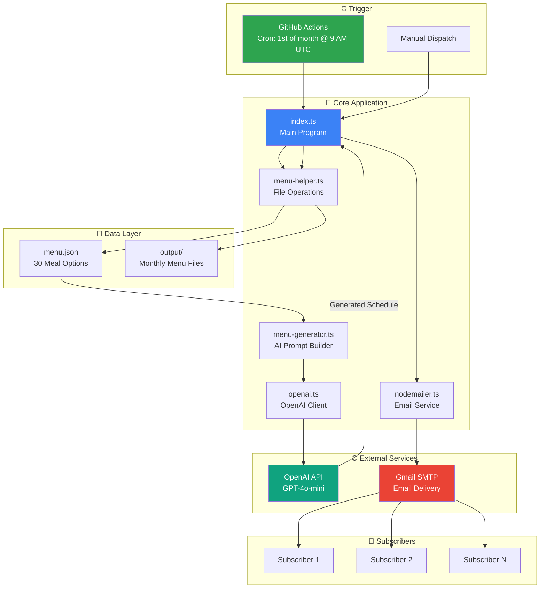
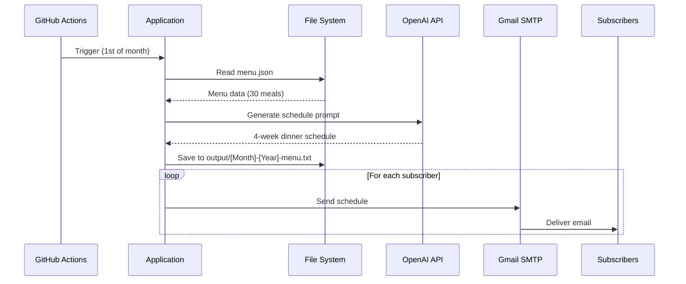
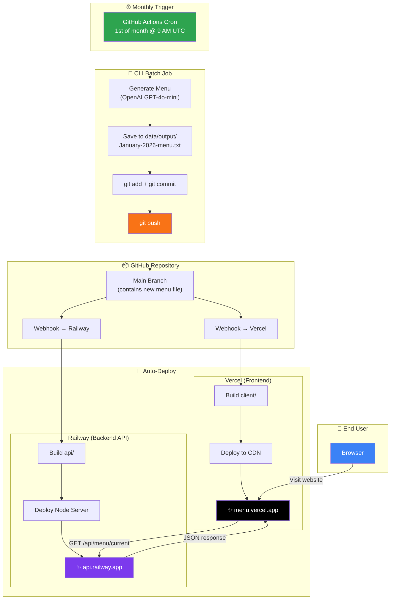

# 🍽️ OpenAI Menu Generator

An automated monthly meal menu generator that uses AI to create dinner schedules and distributes them to subscribers via email.

## 📋 Overview

This application automatically generates a 4-week dinner schedule on the 1st of every month using OpenAI's GPT-4o-mini model. The generated menu is saved locally and emailed to all subscribers, making meal planning effortless and fun.

## ✨ Features

- **AI-Powered Menu Generation**: Uses OpenAI GPT-4o-mini to create varied, randomized weekly dinner schedules
- **Automated Monthly Execution**: GitHub Actions cron job runs on the 1st of each month at 9 AM UTC
- **Email Distribution**: Sends personalized menu schedules to all subscribers via Gmail
- **Local Storage**: Saves generated menus as text files for reference
- **Customizable Menu Database**: Easily add or modify meal options in the JSON config

## 🏗️ System Architecture



## 📂 Project Structure

```
openai-menu-gen/
├── .github/
│   └── workflows/
│       └── generate-menu-schedule.yaml  # Monthly cron job
├── src/
│   ├── data/
│   │   ├── menu.json                    # Meal database (30 options)
│   │   └── output/                      # Generated menu files
│   ├── lib/
│   │   ├── ai/
│   │   │   ├── menu-generator.ts        # AI prompt construction
│   │   │   └── openai.ts                # OpenAI client config
│   │   └── nodemailer.ts                # Email transport config
│   ├── types/
│   │   └── index.d.ts                   # TypeScript definitions
│   ├── utils/
│   │   └── menu-helper.ts               # File read/write utilities
│   └── index.ts                         # Main entry point
├── package.json
├── tsconfig.json
└── vercel.json
```

## 🔄 Data Flow



## 🌐 Deployment Flow

The system uses a fully automated CI/CD pipeline that triggers deployments whenever a new menu is generated:



### Deployment Flow Summary

| Step | Action | Result |
|------|--------|--------|
| 1️⃣ | GitHub Actions triggers on 1st of month | CLI batch job starts |
| 2️⃣ | CLI generates menu via OpenAI | New menu saved to `data/output/` |
| 3️⃣ | CLI commits and pushes to repo | New commit on main branch |
| 4️⃣ | Push triggers Vercel webhook | Frontend auto-redeploys (~30s) |
| 5️⃣ | Push triggers Railway webhook | Backend API auto-redeploys (~1min) |
| 6️⃣ | User visits website | Sees the latest month's menu |

## 🚀 Getting Started

### Prerequisites

- Node.js 22+
- npm
- OpenAI API key
- Gmail account with App Password enabled

### Installation

```bash
# Clone the repository
git clone https://github.com/Marquessmalley/openai_menu-gen.git

# Navigate to project directory
cd openai_menu-gen

# Install dependencies
npm install
```

### Environment Variables

Create a `.env` file in the root directory:

```env
OPEN_AI_KEY=your_openai_api_key
EMAIL=your_gmail_address
PASSWORD=your_gmail_app_password
```

### Running Locally

```bash
# Build the TypeScript
npm run build

# Run the program
npm run start
```

## ⚙️ Configuration

### Adding Subscribers

Edit the `subcribers` array in `src/index.ts`:

```typescript
const subcribers: string[] = ["email1@example.com", "email2@example.com"];
```

### Customizing the Menu

Add or modify meals in `src/data/menu.json`:

```json
{
  "id": 31,
  "name": "Your New Meal",
  "sides": ["side 1", "side 2"]
}
```

## 📅 Automation

The application runs automatically via GitHub Actions:

- **Schedule**: 1st of every month at 9:00 AM UTC
- **Manual Trigger**: Available via GitHub Actions "workflow_dispatch"

### Required GitHub Secrets

| Secret        | Description               |
| ------------- | ------------------------- |
| `OPEN_AI_KEY` | Your OpenAI API key       |
| `EMAIL`       | Gmail address for sending |
| `PASSWORD`    | Gmail App Password        |

## 🛠️ Tech Stack

- **Runtime**: Node.js 22
- **Language**: TypeScript
- **AI**: OpenAI GPT-4o-mini
- **Email**: Nodemailer with Gmail SMTP
- **CI/CD**: GitHub Actions
- **Hosting**: Vercel (optional)

## 📧 Sample Output

Each generated menu includes:

- A funny, topical joke about current events
- 4 weeks of Monday-Friday dinner schedules
- Meal names with their accompanying sides

```
Why did the turkey run for president? Because it wanted to be the one
getting pardoned this Thanksgiving! 🦃

WEEK 1
Monday: Grilled Chicken with Rice and Veggies - Sides: rice, steamed vegetables
Tuesday: Tacos with Spanish Rice - Sides: spanish rice, refried beans
...
```

## 📄 License

ISC

## 👤 Author

Marquess Smalley

---

_Made with ❤️ and AI_
