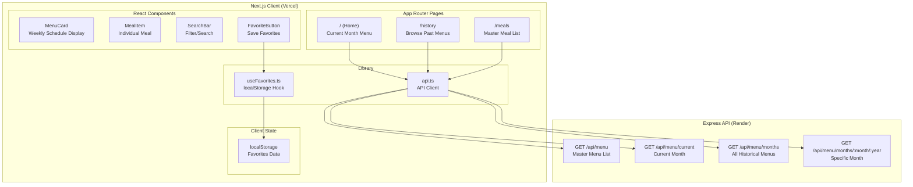
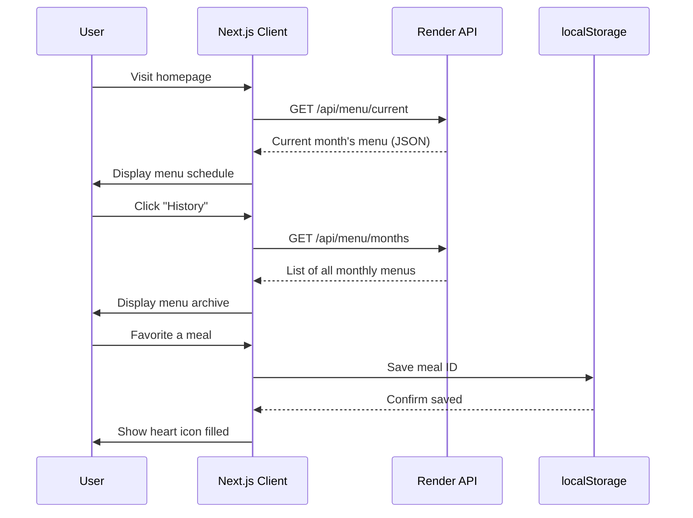
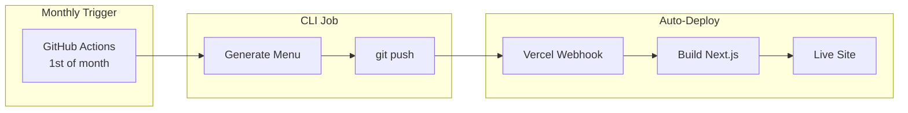

# Menu Generator Client

A Next.js frontend application for displaying AI-generated monthly dinner menus.

## Overview

This client application provides a modern, responsive interface for viewing dinner menu schedules generated by OpenAI. It connects to the Menu Generator API to fetch and display current and historical monthly menus.

## Architecture



## Data Flow



## Tech Stack

| Technology | Purpose |
|------------|---------|
| **Next.js 15** | React framework with App Router |
| **TypeScript** | Type safety |
| **Tailwind CSS** | Utility-first styling |
| **Geist Font** | Typography |

## Project Structure

```
client/
├── src/
│   ├── app/
│   │   ├── layout.tsx         # Root layout with navigation
│   │   ├── page.tsx           # Home - current month's menu
│   │   ├── globals.css        # Global styles
│   │   ├── history/
│   │   │   └── page.tsx       # Historical menus browser
│   │   └── meals/
│   │       └── page.tsx       # Master meal list with search
│   ├── components/
│   │   ├── MenuCard.tsx       # Displays a week's menu
│   │   ├── MealItem.tsx       # Individual meal with sides
│   │   ├── SearchBar.tsx      # Search/filter input
│   │   └── FavoriteButton.tsx # Heart icon toggle
│   ├── hooks/
│   │   └── useFavorites.ts    # localStorage favorites hook
│   └── lib/
│       └── api.ts             # API client functions
├── public/                    # Static assets
├── package.json
├── tsconfig.json
├── tailwind.config.ts
└── next.config.ts
```

## API Integration

The client connects to the Menu Generator API hosted on Render.

### Endpoints Used

| Endpoint | Description |
|----------|-------------|
| `GET /api/menu` | Fetch master list of all available meals |
| `GET /api/menu/current` | Fetch current month's generated menu |
| `GET /api/menu/months` | Fetch list of all historical menus |
| `GET /api/menu/months/:month/:year` | Fetch a specific month's menu |

### Configuration

The API base URL is configured via environment variable:

```env
# .env.local (development)
NEXT_PUBLIC_API_URL=http://localhost:3000/api

# Production (set in Vercel dashboard)
NEXT_PUBLIC_API_URL=https://openai-menu-gen.onrender.com/api
```

## Getting Started

### Prerequisites

- Node.js 18+
- npm or yarn

### Installation

```bash
# Navigate to client directory
cd client

# Install dependencies
npm install
```

### Development

```bash
# Start development server
npm run dev
```

Open [http://localhost:3000](http://localhost:3000) to view the app.

### Production Build

```bash
# Build for production
npm run build

# Start production server
npm start
```

## Deployment

This application is designed to deploy on **Vercel**.

### Vercel Setup

1. Connect your GitHub repository to Vercel
2. Set the root directory to `client`
3. Add environment variable:
   - `NEXT_PUBLIC_API_URL` = `https://openai-menu-gen.onrender.com/api`
4. Deploy

### Auto-Deploy Flow



When a new menu is generated and pushed to the repository, Vercel automatically rebuilds and deploys the client with the latest data.

## Features

- **Current Menu View** - Display this month's dinner schedule
- **Historical Archive** - Browse menus from previous months
- **Meal Database** - Search and filter all available meals
- **Favorites** - Save your favorite meals (persisted in localStorage)
- **Responsive Design** - Works on desktop, tablet, and mobile
- **Dark Mode** - Automatic dark/light theme support

## License

ISC
